# Market Pro - Sistema de Facturación

Aplicación de escritorio desarrollada con Electron, React y FastAPI para gestión de:

* Ventas
* Inventario
* Productos
* Facturación
* Reportes

## Demo

Próximamente video demo.

## Tecnologías

* Electron
* React
* Javascript
* FastAPI
* SQLite/PostgreSQL

## Comprar versión completa

La versión completa del sistema está disponible aquí:

👉 https://rojoandres1.gumroad.com/l/vryjkt

Incluye:

* Instalador para Windows
* Actualizaciones
* Soporte básico
* Configuración inicial

## Capturas

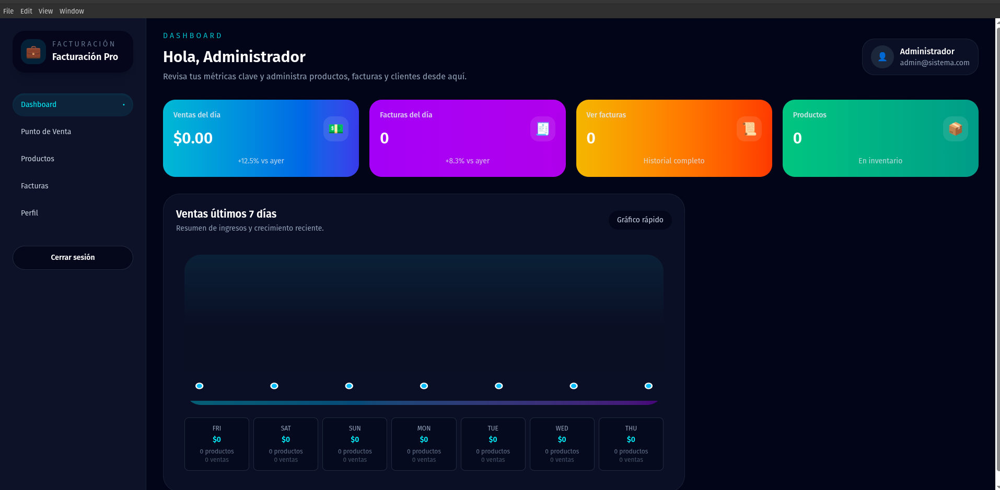
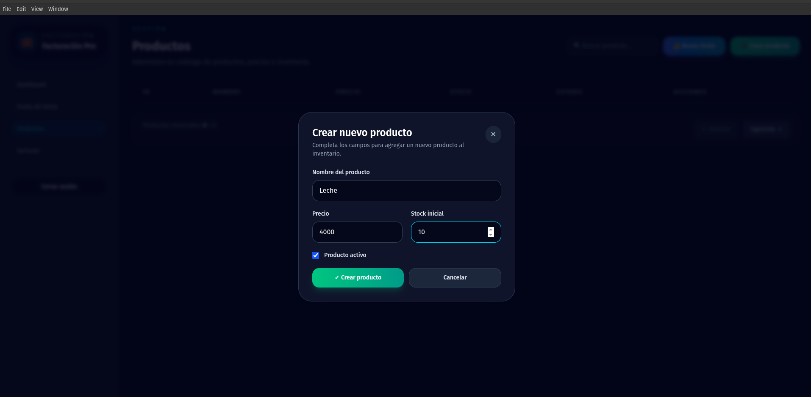
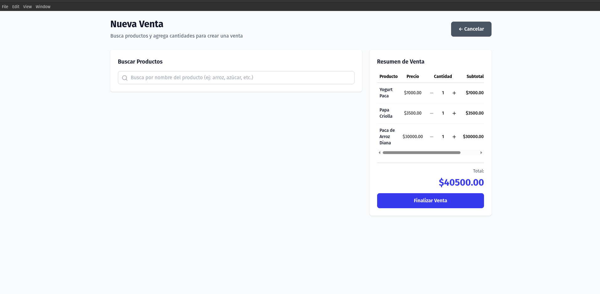
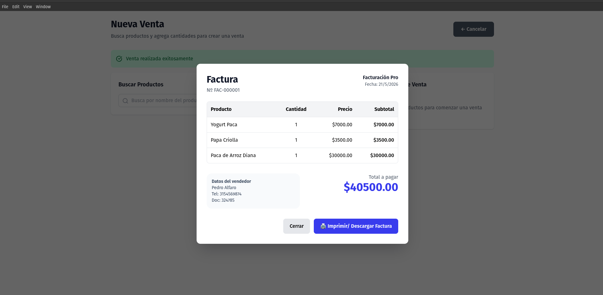
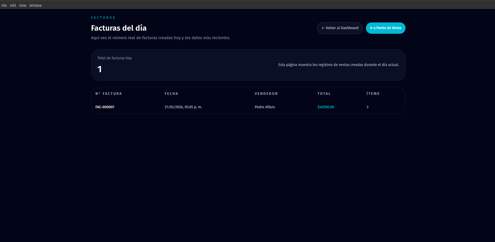
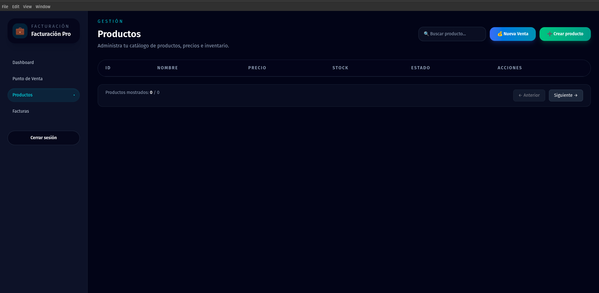
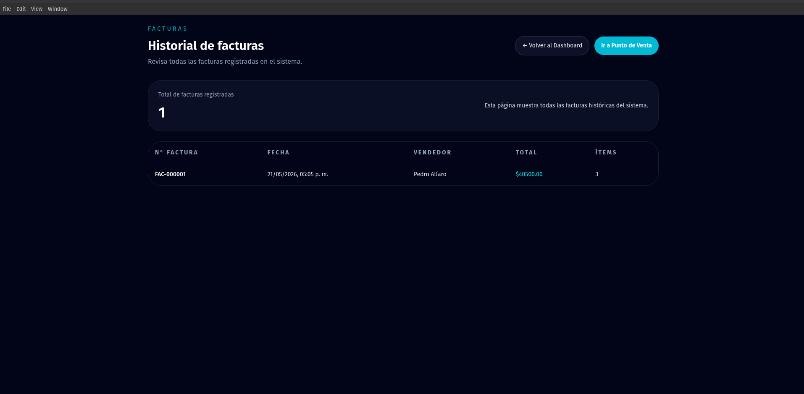

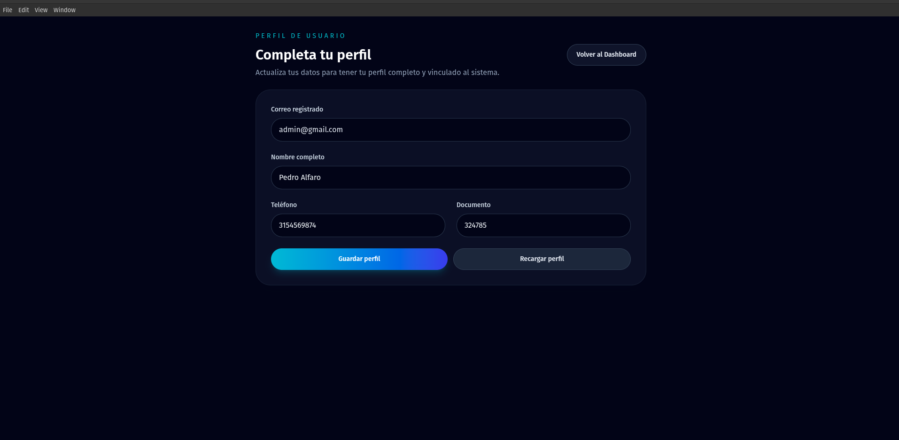
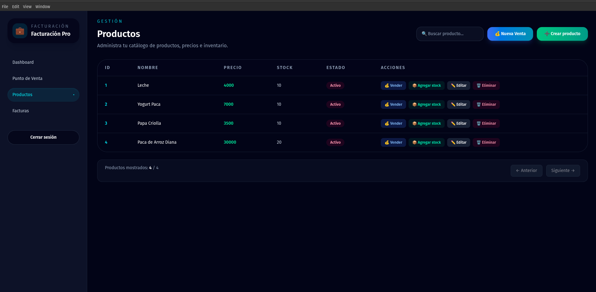
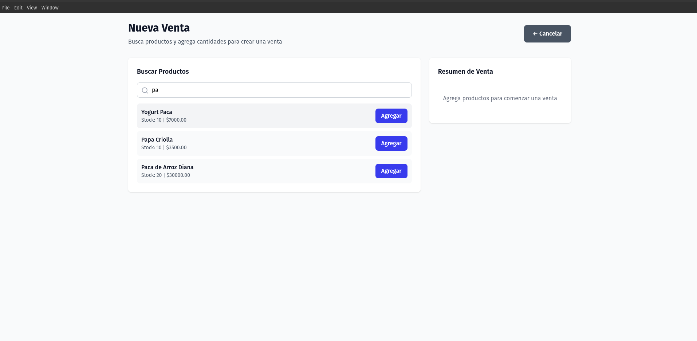
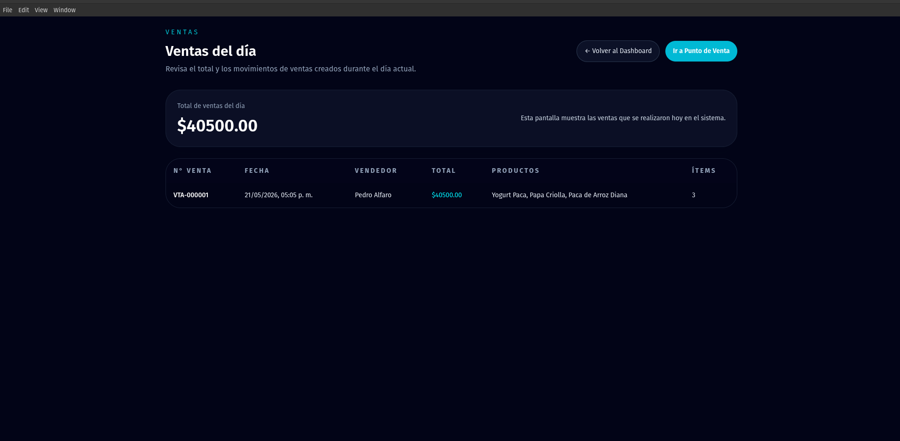

## Licencia

Este repositorio es únicamente demostrativo.
La distribución comercial del software está protegida.
